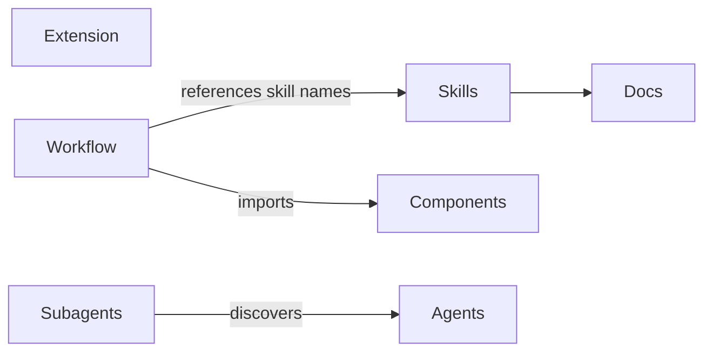
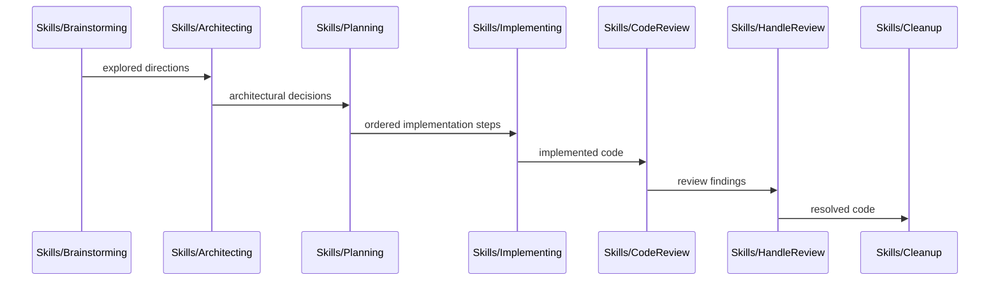

# Codemap

## Overview

A personal [pi coding agent](https://github.com/badlogic/pi-mono) package providing custom workflow skills (brainstorming → architecting → planning → implementing → review → cleanup) and a provider extension for Azure AI Foundry. Built as a pi package with TypeScript (extension) and Markdown (skills, docs).

### Key Flows

The skills form a sequential development workflow pipeline:

## Modules

### Skills

Agent workflow skills that guide the brainstorm → architect → plan → implement → review → cleanup pipeline, plus standalone utilities (codemap, debugging, decision-records, orchestrating-agents, specialist-design).

**Responsibilities:** development workflow orchestration, brainstorming facilitation, architectural decision-making (scout-delegated investigation, DR-awareness and supersession handling), implementation planning (scout-delegated investigation, relaxed step ordering — numbering is authoring order, implementer decides parallelization, conditional blind spot check — subagent compares brainstorm intent vs plan coverage when a brainstorm exists), dual-mode implementation execution (direct for small plans, orchestrated with module-aligned workers and inter-agent channels for larger ones — primary manages plan status and commits, workers write code), code review against plans (parallel plan-adherence and correctness passes via subagent fan-out), review finding resolution, decision record management (format, quality bar, numbering, supersession mechanics, file conventions — standalone or delegated from cleanup), codemap generation, documentation maintenance, cleanup with background delegation (codemap refresh and doc sweep as subagents while primary handles DR extraction, wait-before-commit discipline), structured debugging, subagent orchestration guidance (task decomposition, patterns, topology design, communication modes), specialist agent definition authoring (format reference, scoping, craft principles, description/prompt/task triad)

**Dependencies:** none (skills are loaded by the pi agent harness at runtime)

**Files:**
- `skills/*/SKILL.md`

### Extension

Azure AI Foundry provider extension that auto-discovers model deployments and registers them as pi models with dynamic Azure AD token refresh.

**Responsibilities:** Azure deployment discovery via az CLI, Azure AD token caching, multi-backend stream routing (Anthropic, OpenAI completions, OpenAI responses), model metadata catalog

**Dependencies:** none (standalone extension loaded by pi)

**Files:**
- `extensions/azure-foundry/**`

### Components

Reusable TUI components shared across extensions. Built on `@mariozechner/pi-tui` primitives and exposed as async functions that take an `ExtensionContext`.

**Responsibilities:** numbered select dialog with keyboard shortcuts and optional inline text annotation

**Dependencies:** none (standalone library consumed by extensions)

**Files:**
- `lib/components/**`

### Workflow Extension

Pipeline orchestration extension that ties the skill pipeline into an automated workflow with artifact-driven handoffs.

**Responsibilities:** pipeline orchestration, artifact inventory scanning, phase transition management (flexible vs mandatory context boundaries, with numbered select UI for phase transition dialogs), `/workflow` entry point command, `workflow_phase_complete` tool, session lifecycle for context clearing

**Dependencies:** Skills (references skill names for phase routing), Components (numbered select for phase transition dialogs)

**Files:**
- `extensions/workflow/**`

### Subagents Extension

Long-lived subagent orchestration extension that spawns and manages child `pi --mode rpc` processes with channel-based inter-agent communication and incremental membership.

**Responsibilities:** subagent lifecycle management (incremental spawn via `start()`, selective single-agent or full teardown, lazy infrastructure creation on first spawn, automatic cleanup when last agent removed), RPC child process spawning and event streaming, mutable channel topology (build, validate, `addToTopology`/`removeFromTopology` for incremental membership, runtime send checks), unix socket message broker (hub-and-spoke routing, blocking send correlation, synthetic error responses, `agentCrashed`/`agentRemoved` with reason-tracked `removedAgents` map), deadlock detection (directed graph cycle detection via DFS), structured XML message serialization (inter-agent messages, completion notifications, group reports, identity blocks), agent discovery with skill filtering and system prompt injection (before_agent_start hook surfaces available definitions when subagent tool is active), package-sourced agent discovery (session_start-cached, uses SettingsManager + DefaultPackageManager to resolve installed packages, reads `pi.agents` manifest key, four-tier merge: package:user → user-dir → package:project → project-dir), TUI dashboard widget (WrapPanel box-card layout with state-colored borders, per-agent context fill %, activity overflow, channel wait-highlighting, recursive subgroup indicator, aggregate footer bar; Component-based via setWidget factory, gated on root agent), six-tool suite (`subagent`, `fork`, `send`, `respond`, `check_status`, `teardown`) with notification-driven flow guidelines, fork tool (clones parent via `--fork` session branching, required `id` param, inherits tools/skills/thinking-level from parent state, `AgentSpec` discriminated union routes fork vs regular spawning in SubagentManager), shared temp session directory for all child processes (cleaned up when infrastructure torn down), notification queue (batched delivery with debounced flush, source-tagged entries for selective draining on recursive teardown, busy-state tracking via agent_start/agent_end), correlation origin tracking (routes respond calls to the correct broker in recursive setups), role detection via `PI_PARENT_LINK` env var (symmetric — any agent can be both parent and child), recursive subagent support with dual broker client management (uplink to parent + local for own sub-group)

**Dependencies:** `@mariozechner/pi-coding-agent` (ExtensionAPI, tool registration, widget API, promptGuidelines)

**Files:**
- `extensions/subagents/index.ts` — entry point, role detection (PI_PARENT_LINK), tool registration (subagent + fork + send/respond/check_status/teardown), lazy SubagentManager instantiation (once, reused across calls), notification queue (batched delivery with source tagging), agent definition injection (before_agent_start), package agent cache (populated at session_start, refreshed on /reload), correlation origin tracking, dual broker client management (uplink + local), factory widget setup gated on parentLink, context window resolution via modelRegistry
- `extensions/subagents/agents.ts` — agent `.md` discovery with skills field, `AgentSpec` discriminated union (`RegularAgentSpec | ForkAgentSpec`), `buildAgentArgs` and `buildForkArgs` CLI arg builders, system prompt extraction, `discoverPackageAgents()` for installed-package agent loading via PackageManager API, four-tier merge in `discoverAgents()` (package:user → user-dir → package:project → project-dir)
- `extensions/subagents/broker.ts` — unix socket message broker, channel enforcement, correlation tracking, reason-tracked removed agents (`removedAgents: Map<string, "crashed" | "removed">`), separate `agentCrashed`/`agentRemoved` methods with differentiated error messages
- `extensions/subagents/channels.ts` — topology building, validation, mutable topology operations (`addToTopology` with inline validation and fork-aware channel expansion, `removeFromTopology`), runtime send checks
- `extensions/subagents/deadlock.ts` — directed graph with cycle detection for blocking sends
- `extensions/subagents/group.ts` — SubagentManager: long-lived manager with lazy infrastructure (broker + topology created on first `start()`, torn down when last agent removed), incremental agent spawning, selective `teardown(id?)` (single-agent removal with broker notification and topology update, or full teardown), fork-aware spawning (branches on `AgentSpec.kind`), shared temp session directory lifecycle, state tracking (per-turn input, context window resolution, subgroup detection, waitingFor targets with correlation-to-target mapping), parent message callback delegation
- `extensions/subagents/messages.ts` — XML serializers and broker wire protocol types
- `extensions/subagents/rpc-child.ts` — lightweight JSONL protocol wrapper around `pi --mode rpc`
- `extensions/subagents/widget.ts` — SubagentDashboard Component class: WrapPanel box-card layout with state-colored borders (rounded/double for failed), per-agent context fill %, activity with overflow, channel wait-highlighting, recursive subgroup indicator, aggregate footer bar
- `extensions/subagents/package.json` — package manifest

### Onboarding

Package onboarding prompt template and the behavioral conventions it installs. The `/onboard` command walks the user through the package's features and offers to copy `SYSTEM.md` into their `AGENTS.md`.

**Responsibilities:** package feature tour, `SYSTEM.md` install walkthrough, behavioral conventions payload (user-copy-in model, not auto-loaded by pi)

**Dependencies:** none

**Files:**
- `prompts/onboard.md` — `/onboard` prompt template
- `SYSTEM.md` — behavioral conventions installed by the onboard template

### Agents

Package-distributed agent definitions — reusable specialist agents discovered by the subagents extension via the `pi.agents` manifest key.

**Responsibilities:** read-only codebase exploration (scout)

**Dependencies:** Subagents (discovered and spawned by the subagents extension's agent discovery pipeline)

**Files:**
- `agents/*.md`

### Docs

Working artifacts for in-progress workflows and permanent decision records extracted during cleanup.

**Responsibilities:** workflow working artifacts (brainstorms, plans, reviews — ephemeral, produced and consumed by pipeline skills), decision records (DR-NNN format, managed by decision-records skill, consumed by architecting as settled context)

**Dependencies:** Skills (artifacts are produced and consumed by pipeline skills)

**Files:**
- `docs/brainstorms/**`
- `docs/plans/**`
- `docs/reviews/**`
- `docs/decisions/**`

### Pi Internals

Reference documentation for pi's internal behaviors discovered through source exploration. Not upstream docs — these are our own annotations of how pi actually works under the hood, with code locations pinned to specific versions.

**Responsibilities:** documenting pi internal mechanics (message delivery modes, queue semantics, event pipelines) for reuse across future conversations and design decisions

**Dependencies:** none (reference-only, consumed by humans and agents)

**Files:**
- `docs/pi-internals/**`
