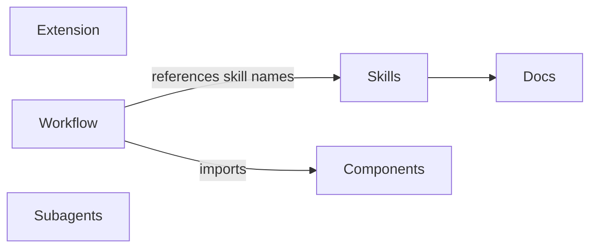
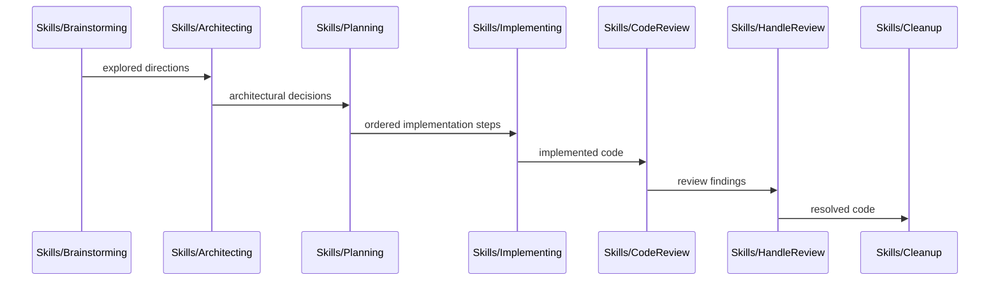

# Codemap

## Overview

A personal [pi coding agent](https://github.com/badlogic/pi-mono) package providing custom workflow skills (brainstorming → architecting → planning → implementing → review → cleanup) and a provider extension for Azure AI Foundry. Built as a pi package with TypeScript (extension) and Markdown (skills, docs).

### Key Flows

The skills form a sequential development workflow pipeline:

## Modules

### Skills

Agent workflow skills that guide the brainstorm → architect → plan → implement → review → cleanup pipeline, plus standalone utilities (codemap, debugging, orchestrating-agents, specialist-design).

**Responsibilities:** development workflow orchestration, brainstorming facilitation, architectural decision-making (with DR-awareness and supersession handling), implementation planning, step-by-step code execution, code review against plans, review finding resolution, decision record extraction (including supersession lifecycle), codemap generation, documentation maintenance, structured debugging, subagent orchestration guidance (task decomposition, patterns, topology design, communication modes), specialist agent definition authoring (format reference, scoping, craft principles, description/prompt/task triad)

**Dependencies:** none (skills are loaded by the pi agent harness at runtime)

**Files:**
- `skills/*/SKILL.md`

### Extension

Azure AI Foundry provider extension that auto-discovers model deployments and registers them as pi models with dynamic Azure AD token refresh.

**Responsibilities:** Azure deployment discovery via az CLI, Azure AD token caching, multi-backend stream routing (Anthropic, OpenAI completions, OpenAI responses), model metadata catalog

**Dependencies:** none (standalone extension loaded by pi)

**Files:**
- `extensions/azure-foundry/**`

### Components

Reusable TUI components shared across extensions. Built on `@mariozechner/pi-tui` primitives and exposed as async functions that take an `ExtensionContext`.

**Responsibilities:** numbered select dialog with keyboard shortcuts and optional inline text annotation

**Dependencies:** none (standalone library consumed by extensions)

**Files:**
- `lib/components/**`

### Workflow Extension

Pipeline orchestration extension that ties the skill pipeline into an automated workflow with artifact-driven handoffs.

**Responsibilities:** pipeline orchestration, artifact inventory scanning, phase transition management (flexible vs mandatory context boundaries, with numbered select UI for phase transition dialogs), `/workflow` entry point command, `workflow_phase_complete` tool, session lifecycle for context clearing

**Dependencies:** Skills (references skill names for phase routing), Components (numbered select for phase transition dialogs)

**Files:**
- `extensions/workflow/**`

### Subagents Extension

Group-based subagent orchestration extension that spawns and manages groups of child `pi --mode rpc` processes with channel-based inter-agent communication.

**Responsibilities:** group lifecycle management (spawn, idle detection, teardown), RPC child process spawning and event streaming, channel-based topology validation and runtime enforcement, unix socket message broker (hub-and-spoke routing, blocking send correlation, synthetic error responses), deadlock detection (directed graph cycle detection via DFS), structured XML message serialization (inter-agent messages, completion notifications, group reports, identity blocks), agent discovery with skill filtering and system prompt injection (before_agent_start hook surfaces available definitions when subagent tool is active), TUI widget rendering (per-agent status, usage, activity), five-tool suite (`subagent`, `send`, `respond`, `check_status`, `teardown_group`) with notification-driven flow guidelines, notification queue (batched delivery with debounced flush, source-tagged entries for selective draining on recursive teardown, busy-state tracking via agent_start/agent_end), correlation origin tracking (routes respond calls to the correct broker in recursive setups), role detection via `PI_PARENT_LINK` env var (symmetric — any agent can be both parent and child), recursive subagent support with dual broker client management (uplink to parent + local for own sub-group)

**Dependencies:** `@mariozechner/pi-coding-agent` (ExtensionAPI, tool registration, widget API, promptGuidelines), `@mariozechner/pi-ai` (StringEnum)

**Files:**
- `extensions/subagents/index.ts` — entry point, role detection (PI_PARENT_LINK), tool registration, notification queue (batched delivery with source tagging), agent definition injection (before_agent_start), correlation origin tracking, dual broker client management (uplink + local)
- `extensions/subagents/agents.ts` — agent `.md` discovery with skills field, CLI arg building, system prompt extraction
- `extensions/subagents/broker.ts` — unix socket message broker, channel enforcement, correlation tracking
- `extensions/subagents/channels.ts` — topology building, validation, and runtime send checks
- `extensions/subagents/deadlock.ts` — directed graph with cycle detection for blocking sends
- `extensions/subagents/group.ts` — group lifecycle, RPC child management, state tracking, idle detection, parent message callback delegation
- `extensions/subagents/messages.ts` — XML serializers and broker wire protocol types
- `extensions/subagents/rpc-child.ts` — lightweight JSONL protocol wrapper around `pi --mode rpc`
- `extensions/subagents/widget.ts` — TUI widget rendering for live group status
- `extensions/subagents/package.json` — package manifest

### Onboarding

Package onboarding prompt template and the behavioral conventions it installs. The `/onboard` command walks the user through the package's features and offers to copy `SYSTEM.md` into their `AGENTS.md`.

**Responsibilities:** package feature tour, `SYSTEM.md` install walkthrough, behavioral conventions payload (user-copy-in model, not auto-loaded by pi)

**Dependencies:** none

**Files:**
- `prompts/onboard.md` — `/onboard` prompt template
- `SYSTEM.md` — behavioral conventions installed by the onboard template

### Docs

Working artifacts for in-progress workflows and permanent decision records extracted during cleanup.

**Responsibilities:** workflow working artifacts (brainstorms, plans, reviews — ephemeral, produced and consumed by pipeline skills), decision records (DR-NNN format, consumed by architecting as settled context, produced/deleted by cleanup including supersession lifecycle)

**Dependencies:** Skills (artifacts are produced and consumed by pipeline skills)

**Files:**
- `docs/brainstorms/**`
- `docs/plans/**`
- `docs/reviews/**`
- `docs/decisions/**`
