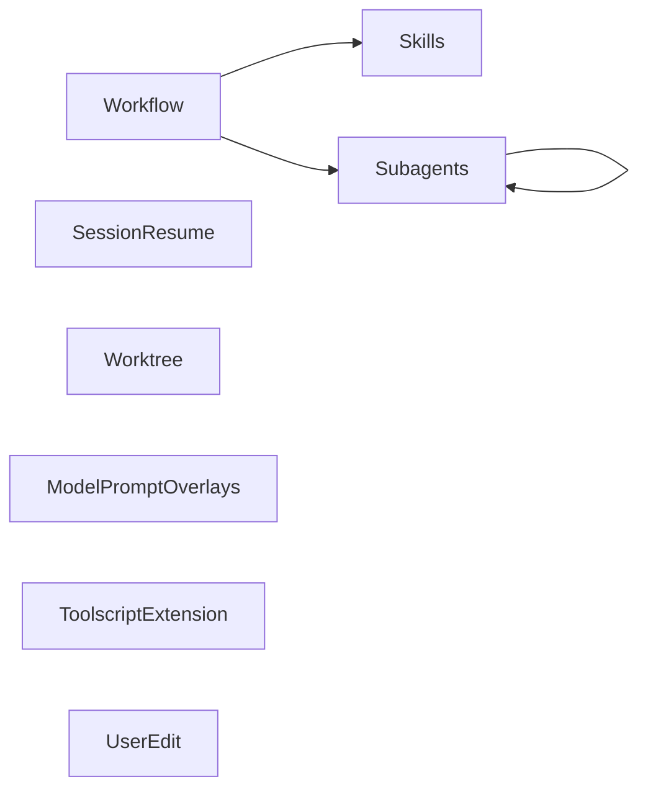
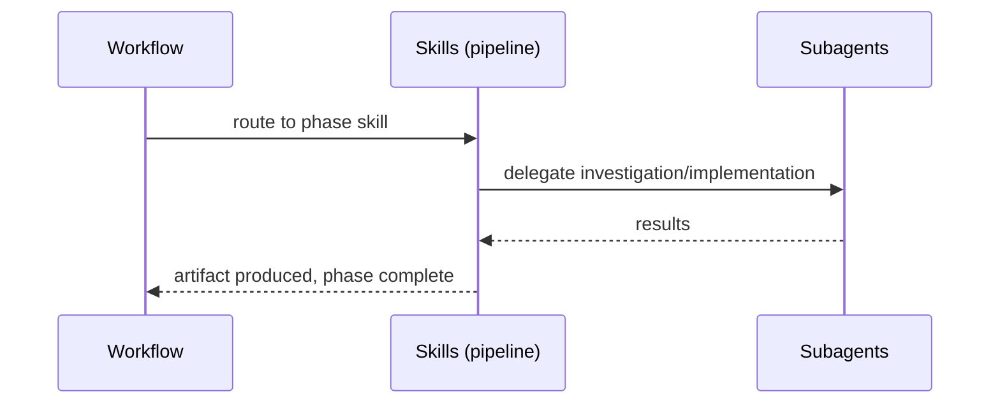

# Codemap

## Overview

A personal [pi coding agent](https://github.com/badlogic/pi-mono) package providing a development workflow pipeline (brainstorm → architect → test-write → test-review → impl-plan → implement → review → handle-review → manual-test → cleanup), standalone utility skills, a subagent orchestration system, and an Azure AI Foundry provider. Built as a pi package with TypeScript extensions and Markdown skills.

### Key Flows

## Modules

### Workflow

The ten workflow skills and the autoflow orchestration skill that drives them. Autoflow is invoked via the `/autoflow` command (a prompt template); the skills define each phase's behavior and autonomous pipeline execution. A bundled transition-check script (`skills/autoflow/check-transition.ts`) validates phase artifacts between subagent handoffs.

**Responsibilities:** pipeline phase routing, artifact-driven handoffs, context boundary management, autonomous pipeline orchestration, autonomous phase transition validation, brainstorming facilitation, architectural decision-making, test writing, test review, implementation planning, dual-mode implementation execution, plan-based code review, review finding resolution, human-style manual testing with a persistent smoke suite, post-workflow cleanup with DR extraction

**Dependencies:** Skills (decision-records skill delegated from cleanup; autoflow orchestrates the pipeline from brainstorm through cleanup), Subagents (workflow skills delegate to subagents at runtime — scout investigation in architecting/impl-planning, worker orchestration in implementing, parallel fan-out in code review, autonomous phase execution in autoflow)

**Files:**
- `skills/autoflow/SKILL.md`
- `skills/autoflow/check-transition.ts`
- `skills/autoflow/check-transition.test.ts`
- `skills/brainstorming/SKILL.md`
- `skills/architecting/SKILL.md`
- `skills/test-writing/SKILL.md`
- `skills/test-review/SKILL.md`
- `skills/impl-planning/SKILL.md`
- `skills/implementing/SKILL.md`
- `skills/code-review/SKILL.md`
- `skills/handle-review/SKILL.md`
- `skills/manual-testing/SKILL.md`
- `skills/cleanup/SKILL.md`
- `docs/brainstorms/**`
- `docs/plans/**`
- `docs/reviews/**`
- `docs/manual-tests/**`

### Skills

Standalone utility skills not tied to the workflow pipeline.

**Responsibilities:** codemap generation and maintenance, structured debugging, decision record management (format, numbering, supersession)

**Dependencies:** none

**Files:**
- `skills/codemap/SKILL.md`
- `skills/debugging/SKILL.md`
- `skills/decision-records/SKILL.md`
- `docs/decisions/**`

### Subagents

Long-lived subagent orchestration extension — spawns and manages child pi processes with channel-based messaging and incremental membership. Includes agent definitions and skills for using/creating agents.

**Responsibilities:** subagent lifecycle management, persistent per-parent child-session storage, append-only agent lifecycle logging for restore/replay, RPC child process spawning, channel topology and message brokering, deadlock detection, fork-based session branching, blocking await with interrupt handling (`await_agents`), notification queue with waiting-mode drain, TUI dashboard widget, agent definition discovery (four-tier package merge), orchestration guidance, specialist agent authoring guidance. Runtime model: one parent session managing a live set of child agents; bulk spawn/teardown operations are convenience APIs, not durable group identities.

**Dependencies:** none (standalone extension loaded by pi)

**Files:**
- `extensions/subagents/**` — includes `notification-queue.ts` (extracted `NotificationQueue` class) and `notification-queue.test.ts`
- `vitest.config.ts` (repo root — test runner config)
- `skills/orchestrating-agents/SKILL.md`
- `skills/specialist-design/SKILL.md`
- `agents/*.md`

### Session Resume

Extension that detects interrupted sessions and injects resume markers so the agent can orient on restart.

**Responsibilities:** idle-state tracking on agent_end, resume detection on session_start, session-resume debug tooling

**Dependencies:** none (standalone extension loaded by pi)

**Files:**
- `extensions/session-resume/**`
- `scripts/pi-resume-debug.ts`

### Worktree

Extension that manages git worktree–based branch sessions — create a worktree, optionally transfer working changes and session context, resume an existing worktree, or clean up by merging back and removing the worktree.

**Responsibilities:** worktree lifecycle (create, resume, cleanup), branch creation via `git worktree add`, stash-based change transfer between worktrees, merge orchestration (delegates to agent via `sendUserMessage`), cross-cwd session transitions (fork/create/continue), interactive prompts for context transfer and pending-changes policy, `/worktree` command argument parsing and branch-name autocomplete

**Dependencies:** none (standalone extension; uses pi core extension APIs and git CLI at runtime)

**Files:**
- `extensions/worktree/**`

### Azure Foundry

Provider extension that auto-discovers Azure AI Foundry model deployments and registers them as pi models.

**Responsibilities:** Azure deployment discovery via az CLI, Azure AD token caching and refresh, multi-backend stream routing (Anthropic, OpenAI completions, OpenAI responses)

**Dependencies:** none (standalone extension loaded by pi)

**Files:**
- `extensions/azure-foundry/**`

### Toolscript Extension

Extension that integrates toolscript by spawning it as a long-lived MCP child process and surfacing its tools as pi tools.

**Responsibilities:** toolscript process lifecycle (spawn via `StdioClientTransport`, graceful shutdown), MCP client management via `@modelcontextprotocol/sdk`, pi tool registration from MCP tool definitions (prefixed `toolscript_`), layered config file resolution (user `~/.pi/toolscript/toolscript.toml` + project `toolscript.toml`), crash recovery with auto-restart on next tool call

**Dependencies:** none (standalone extension loaded by pi)

**Files:**
- `extensions/toolscript/**`

### Numbered Select

Extension providing a `numbered_select` LLM tool and a reusable `showNumberedSelect` TUI helper — a keyboard-driven selection dialog with inline annotation support.

**Responsibilities:** numbered_select tool registration, interactive numbered-list TUI component, selection + annotation flow

**Dependencies:** none (standalone extension loaded by pi)

**Files:**
- `extensions/numbered-select/**`
- `lib/components/numbered-select.ts`

### User Edit

Extension that provides a `user_edit` LLM tool — opens a file in pi's built-in editor UI so the user can manually edit it. On save, the file is written to disk. Supports new file creation (opens empty, creates on save including parent dirs).

**Responsibilities:** user_edit tool registration, editor UI integration, file read/write with mutation queue, new-file creation with parent directory creation

**Dependencies:** none (standalone extension loaded by pi)

**Files:**
- `extensions/user-edit/**`

### Model Prompt Overlays

Extension that discovers AGENTS.*.md overlay files, matches them against the active model ID via glob patterns, and appends matching content to the system prompt.

**Responsibilities:** context root discovery (global agent dir + ancestor walk, mirroring pi's AGENTS.md resolution), overlay file loading and frontmatter validation (models field), glob-based model ID matching with specificity ranking, deterministic sort order (root order → broad-to-narrow specificity → path), overlay block rendering appended to system prompt, per-session deduplicated diagnostic notifications

**Dependencies:** none (standalone extension; hooks `before_agent_start`)

**Files:**
- `extensions/model-prompt-overlays/**`
