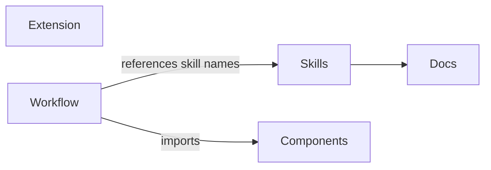
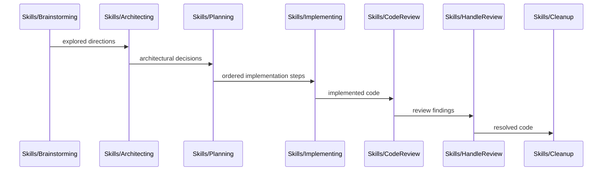

# Codemap

## Overview

A personal [pi coding agent](https://github.com/badlogic/pi-mono) package providing custom workflow skills (brainstorming → architecting → planning → implementing → review → cleanup) and a provider extension for Azure AI Foundry. Built as a pi package with TypeScript (extension) and Markdown (skills, docs).

### Key Flows

The skills form a sequential development workflow pipeline:

## Modules

### Skills

Agent workflow skills that guide the brainstorm → architect → plan → implement → review → cleanup pipeline, plus standalone utilities (codemap, debugging).

**Responsibilities:** development workflow orchestration, brainstorming facilitation, architectural decision-making (with DR-awareness and supersession handling), implementation planning, step-by-step code execution, code review against plans, review finding resolution, decision record extraction (including supersession lifecycle), codemap generation, documentation maintenance, structured debugging

**Dependencies:** none (skills are loaded by the pi agent harness at runtime)

**Files:**
- `skills/*/SKILL.md`

### Extension

Azure AI Foundry provider extension that auto-discovers model deployments and registers them as pi models with dynamic Azure AD token refresh.

**Responsibilities:** Azure deployment discovery via az CLI, Azure AD token caching, multi-backend stream routing (Anthropic, OpenAI completions, OpenAI responses), model metadata catalog

**Dependencies:** none (standalone extension loaded by pi)

**Files:**
- `extensions/azure-foundry/**`

### Components

Reusable TUI components shared across extensions. Built on `@mariozechner/pi-tui` primitives and exposed as async functions that take an `ExtensionContext`.

**Responsibilities:** numbered select dialog with keyboard shortcuts and optional inline text annotation

**Dependencies:** none (standalone library consumed by extensions)

**Files:**
- `lib/components/**`

### Workflow Extension

Pipeline orchestration extension that ties the skill pipeline into an automated workflow with artifact-driven handoffs.

**Responsibilities:** pipeline orchestration, artifact inventory scanning, phase transition management (flexible vs mandatory context boundaries, with numbered select UI for phase transition dialogs), `/workflow` entry point command, `workflow_phase_complete` tool, session lifecycle for context clearing

**Dependencies:** Skills (references skill names for phase routing), Components (numbered select for phase transition dialogs)

**Files:**
- `extensions/workflow/**`

### Docs

Working artifacts for in-progress workflows (brainstorms, plans, reviews) and permanent decision records extracted during cleanup.

**Responsibilities:** workflow working artifacts, decision records (DR-NNN format, consumed by architecting as settled context, produced/deleted by cleanup including supersession lifecycle)

**Dependencies:** Skills (artifacts are produced and consumed by pipeline skills)

**Files:**
- `docs/brainstorms/**`
- `docs/plans/**`
- `docs/reviews/**`
- `docs/decisions/**`
