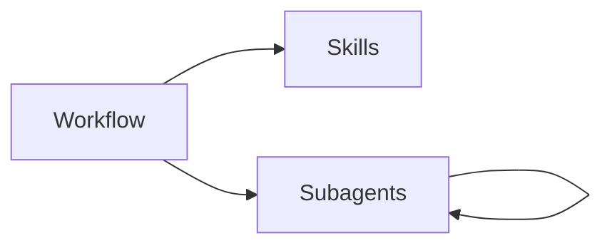
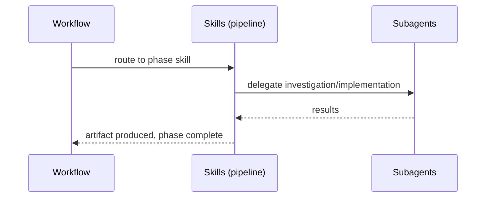

# Codemap

## Overview

A personal [pi coding agent](https://github.com/badlogic/pi-mono) package providing a development workflow pipeline (brainstorm → architect → test-write → test-review → impl-plan → implement → review → handle review → cleanup), standalone utility skills, a subagent orchestration system, and an Azure AI Foundry provider. Built as a pi package with TypeScript extensions and Markdown skills.

### Key Flows

## Modules

### Workflow

Pipeline orchestration extension, the nine workflow skills it drives, and the autoflow orchestration skill. The extension provides the `/workflow` command and `workflow_phase_complete` tool; the skills define each phase's behavior and autonomous pipeline execution.

**Responsibilities:** pipeline phase routing, artifact-driven handoffs, context boundary management, autonomous pipeline orchestration, autonomous phase transition validation, brainstorming facilitation, architectural decision-making, test writing, test review, implementation planning, dual-mode implementation execution, plan-based code review, review finding resolution, post-workflow cleanup with DR extraction

**Dependencies:** Skills (decision-records skill delegated from cleanup; autoflow orchestrates the pipeline from brainstorm through cleanup), Subagents (workflow skills delegate to subagents at runtime — scout investigation in architecting/impl-planning, worker orchestration in implementing, parallel fan-out in code review, autonomous phase execution in autoflow)

**Files:**
- `extensions/workflow/**`
- `extensions/numbered-select/**`
- `lib/components/**`
- `skills/autoflow/SKILL.md`
- `skills/brainstorming/SKILL.md`
- `skills/architecting/SKILL.md`
- `skills/test-writing/SKILL.md`
- `skills/test-review/SKILL.md`
- `skills/impl-planning/SKILL.md`
- `skills/implementing/SKILL.md`
- `skills/code-review/SKILL.md`
- `skills/handle-review/SKILL.md`
- `skills/cleanup/SKILL.md`
- `docs/brainstorms/**`
- `docs/plans/**`
- `docs/reviews/**`

### Skills

Standalone utility skills not tied to the workflow pipeline.

**Responsibilities:** codemap generation and maintenance, structured debugging, decision record management (format, numbering, supersession)

**Dependencies:** none

**Files:**
- `skills/codemap/SKILL.md`
- `skills/debugging/SKILL.md`
- `skills/decision-records/SKILL.md`
- `docs/decisions/**`

### Subagents

Long-lived subagent orchestration extension — spawns and manages child pi processes with channel-based messaging and incremental membership. Includes agent definitions and skills for using/creating agents.

**Responsibilities:** subagent lifecycle management, persistent per-parent child-session storage, append-only agent lifecycle logging for restore/replay, RPC child process spawning, channel topology and message brokering, deadlock detection, fork-based session branching, blocking await with interrupt handling (`await_agents`), notification queue with waiting-mode drain, TUI dashboard widget, agent definition discovery (four-tier package merge), orchestration guidance, specialist agent authoring guidance. Runtime model: one parent session managing a live set of child agents; bulk spawn/teardown operations are convenience APIs, not durable group identities.

**Dependencies:** none (standalone extension loaded by pi)

**Files:**
- `extensions/subagents/**` — includes `notification-queue.ts` (extracted `NotificationQueue` class) and `notification-queue.test.ts`
- `vitest.config.ts` (repo root — test runner config)
- `skills/orchestrating-agents/SKILL.md`
- `skills/specialist-design/SKILL.md`
- `agents/*.md`

### Azure Foundry

Provider extension that auto-discovers Azure AI Foundry model deployments and registers them as pi models.

**Responsibilities:** Azure deployment discovery via az CLI, Azure AD token caching and refresh, multi-backend stream routing (Anthropic, OpenAI completions, OpenAI responses)

**Dependencies:** none (standalone extension loaded by pi)

**Files:**
- `extensions/azure-foundry/**`
