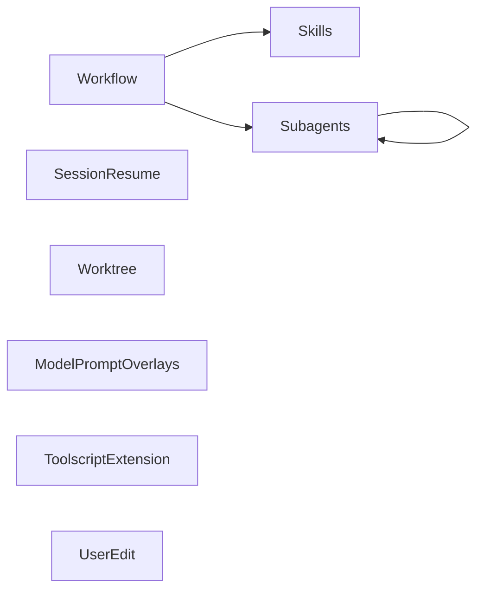
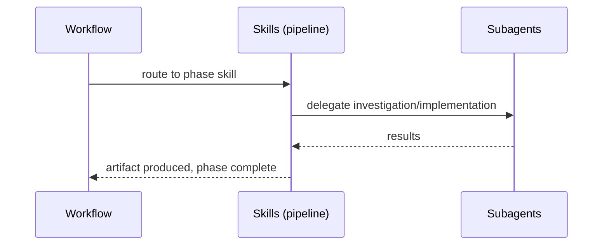

# Codemap

## Overview

A personal [pi coding agent](https://github.com/badlogic/pi-mono) package providing a development workflow pipeline (brainstorm → architect → test-write → test-review → impl-plan → implement → review → handle-review → manual-test → cleanup), standalone utility skills, a subagent orchestration system, an Azure AI Foundry provider, and quota-aware provider support. Built as a pi package with TypeScript extensions and Markdown skills.

### Key Flows

## Modules

### Workflow

The ten workflow skills and the autoflow orchestration skill that drives them. Autoflow is invoked via the `/autoflow` command (a prompt template); the skills define each phase's behavior and autonomous pipeline execution. A bundled transition-check script (`skills/autoflow/check-transition.ts`) validates phase artifacts between subagent handoffs.

**Responsibilities:** pipeline phase routing, artifact-driven handoffs, context boundary management, autonomous pipeline orchestration, autonomous phase transition validation, brainstorming facilitation, architectural decision-making, test writing, test review, implementation planning, dual-mode implementation execution, plan-based code review, review finding resolution, human-style manual testing with a persistent smoke suite, post-workflow cleanup with DR extraction

**Dependencies:** Skills (decision-records skill delegated from cleanup; autoflow orchestrates the pipeline from brainstorm through cleanup), Subagents (workflow skills delegate to subagents at runtime — scout investigation in architecting/impl-planning, worker orchestration in implementing, parallel fan-out in code review, autonomous phase execution in autoflow)

**Files:**
- `skills/autoflow/SKILL.md`
- `skills/autoflow/check-transition.ts`
- `skills/autoflow/check-transition.test.ts`
- `skills/brainstorming/SKILL.md`
- `skills/architecting/SKILL.md`
- `skills/test-writing/SKILL.md`
- `skills/test-review/SKILL.md`
- `skills/impl-planning/SKILL.md`
- `skills/implementing/SKILL.md`
- `skills/code-review/SKILL.md`
- `skills/handle-review/SKILL.md`
- `skills/manual-testing/SKILL.md`
- `skills/cleanup/SKILL.md`
- `docs/brainstorms/**`
- `docs/plans/**`
- `docs/reviews/**`
- `docs/manual-tests/**`
- `tools/manual-test/**`

### Skills

Standalone utility skills not tied to the workflow pipeline.

**Responsibilities:** codemap generation and maintenance, structured debugging, decision record management (format, numbering, supersession), skill authoring guidance (invocation axis, information hierarchy, pruning, leading words), domain language maintenance (glossary.md convention, active term-sharpening discipline), code design doctrine (deep modules/seams at module level, function-level principles in FUNCTIONS.md — referenced by the pipeline skills), periodic architecture review (user-invoked deepening scan with HTML report)

**Dependencies:** none

**Files:**
- `skills/codemap/SKILL.md`
- `skills/debugging/SKILL.md`
- `skills/decision-records/SKILL.md`
- `skills/skill-writing/SKILL.md`
- `skills/skill-writing/GLOSSARY.md`
- `skills/domain-modeling/SKILL.md`
- `skills/domain-modeling/FORMAT.md`
- `skills/codebase-design/SKILL.md`
- `skills/codebase-design/FUNCTIONS.md`
- `skills/codebase-design/DEEPENING.md`
- `skills/codebase-design/DESIGN-IT-TWICE.md`
- `skills/improve-code/SKILL.md`
- `docs/decisions/**`

### Subagents

Long-lived subagent orchestration extension — spawns and manages child pi processes with channel-based messaging and incremental membership. Includes agent definitions and skills for using/creating agents.

**Responsibilities:** subagent lifecycle management, model-intelligence tier resolution (`cheap`/`medium`/`smart`/`frontier` tier names — the advertised vocabulary for the `subagent` tool's `model` field and agent-definition pins — resolved to concrete model IDs at spawn time from a JSON config overlay: `~/.pi/agent/model-tiers.json` global + `.pi/model-tiers.json` project override, the latter honored only when the project is trusted; malformed config is tolerated by dropping bad entries; unconfigured or unavailable tiers fall back to the child's session default with a once-per-extension-load notice; raw model IDs and thinking-level suffixes pass through unchanged; tier config values stay plain strings (`TierConfig` type unchanged); system-prompt injection renders a Model Tiers table — via `renderTierTable` — replacing the former Available Models list and now advertises the `model:<level>` shorthand with the six valid levels (`off`, `minimal`, `low`, `medium`, `high`, `xhigh`); model resolution is suffix-aware: the `stripThinkingSuffix` pure helper splits a trailing `:<valid-level>` off a model string (only if the suffix is one of the six levels, so colon-bearing model IDs like `openai/gpt-x:exacto` are left whole), and both `resolveModelRef` and `renderTierTable` judge availability on the model part alone while passing the full suffixed string through as the `--model` value), on-demand model catalog discovery (`list_models` tool — full available-model table with context window and pricing, for the rare case a concrete model id is explicitly required), persistent per-parent child-session storage, append-only agent lifecycle logging for restore/replay, faithful subagent status recomputation on parent-session resume (each restored child's own pi session JSONL is re-parsed via a pure forward-pass parser to seed `state: idle` plus snapshot-derived usage/model/lastOutput/context-fill/`hasSubgroup`, following a recompute-over-replicate principle rather than a fabricated `running`/zeroed seed; event-driven transitions flip back to `running` if the child auto-resumes), RPC child process spawning, channel topology and message brokering, deadlock detection, fork-based session branching, blocking await with interrupt handling (`await_agents`), notification queue with waiting-mode drain, TUI dashboard widget, agent definition discovery (four-tier package merge), orchestration guidance, specialist agent authoring guidance, generic prompt-failure surfacing (when a child emits an error-level notify while marked running with no `agent_start` since its last prompt, the entry settles as failed), post-teardown resurrection (`resurrect` tool — revive a torn-down agent from its persisted session file, surfacing `session_id` in completion reports and `<group_complete>` summaries with a usage hint), per-agent working-directory overrides on `subagent` (`agents[].cwd` resolved relative to the parent's cwd, validated batch-atomically as an existing directory, persisted in the agent's session record and replayed on restore, pruned at restore time if the directory has since been deleted; `fork` and `resurrect` deliberately inherit cwd rather than accept overrides). Runtime model: one parent session managing a live set of child agents; bulk spawn/teardown operations are convenience APIs, not durable group identities.

**Dependencies:** none (standalone extension loaded by pi)

**Files:**
- `extensions/subagents/**` — includes `agent-set.ts` (child entry lifecycle and failure detection) and `agent-set.test.ts`; `notification-queue.ts` (extracted `NotificationQueue` class) and `notification-queue.test.ts`; `session-snapshot.ts` (pure forward-pass parser reconstructing a restored child's runtime status from its session JSONL) and `session-snapshot.test.ts`; `model-tiers.ts` (pure tier helpers — `isTierName`, `loadTierConfig`, `resolveModelRef`, `renderTierTable`) and `model-tiers.test.ts`
- `vitest.config.ts` (repo root — test runner config)
- `skills/orchestrating-agents/SKILL.md`
- `skills/specialist-design/SKILL.md`
- `agents/scout.md`
- `agents/ux-designer.md`
- `agents/ux-reviewer.md`

### Session Resume

Extension that detects interrupted sessions and injects resume markers so the agent can orient on restart.

**Responsibilities:** idle-state tracking on agent_end, resume detection on session_start, session-resume debug tooling

**Dependencies:** none (standalone extension loaded by pi)

**Files:**
- `extensions/session-resume/**`
- `scripts/pi-resume-debug.ts`

### Worktree

Extension that manages git worktree–based branch sessions — create a worktree, optionally transfer working changes and session context, resume an existing worktree, or clean up by merging back and removing the worktree.

**Responsibilities:** worktree lifecycle (create, resume, cleanup), branch creation via `git worktree add`, stash-based change transfer between worktrees, merge orchestration (delegates to agent via `sendUserMessage`), cross-cwd session transitions (fork/create/continue), interactive prompts for context transfer and pending-changes policy, `/worktree` command argument parsing and branch-name autocomplete

**Dependencies:** none (standalone extension; uses pi core extension APIs and git CLI at runtime)

**Files:**
- `extensions/worktree/**`

### Quota Providers

Generic quota-aware provider extension. Out-of-repo provider implementations plug in through typed seams (model discovery, auth, usage). Core adds pro-rated spend backpressure so a provider's billing window isn't burned early. Implementations are loaded via jiti from a config file at `~/.pi/agent/quota-providers.json`.

**Responsibilities:** implementation discovery and registration via config file, provider model discovery (block-once cold start, background refresh), token management via out-of-band runner, usage polling via out-of-band runner, ledger-based spend tracking (local accumulation between snapshots), pro-rated soft-cap enforcement at prompt boundary, opt-in hard-cap enforcement, session-scoped bypass with shared-file propagation to subagents, `/quota` command (status + bypass toggle), footer/statusline indicator

**Dependencies:** none (standalone extension loaded by pi); uses `@earendil-works/pi-ai` for catalog metadata lookup

**Files:**
- `extensions/quota-providers/index.ts`
- `extensions/quota-providers/package.json`
- `extensions/quota-providers/runner.mjs`
- `extensions/quota-providers/lib/types.ts`
- `extensions/quota-providers/lib/config.ts`
- `extensions/quota-providers/lib/config.test.ts`
- `extensions/quota-providers/lib/quota.ts`
- `extensions/quota-providers/lib/quota.test.ts`
- `extensions/quota-providers/lib/ledger.ts`
- `extensions/quota-providers/lib/ledger.test.ts`
- `extensions/quota-providers/lib/bypass.ts`
- `extensions/quota-providers/lib/bypass.test.ts`
- `extensions/quota-providers/lib/registration.ts`
- `extensions/quota-providers/lib/registration.test.ts`
- `extensions/quota-providers/lib/enforce.ts`
- `extensions/quota-providers/lib/enforce.test.ts`
- `extensions/quota-providers/lib/fsio.ts`
- `extensions/quota-providers/lib/snapshot.ts`
- `extensions/quota-providers/runner.test.ts`
- `extensions/quota-providers/test/fake-impl.ts`

### Azure Foundry

Provider extension that auto-discovers Azure AI Foundry model deployments and registers them as pi models.

**Responsibilities:** Azure deployment discovery via az CLI, Azure AD token caching and refresh, multi-backend stream routing (Anthropic, OpenAI completions, OpenAI responses)

**Dependencies:** none (standalone extension loaded by pi)

**Notes:** The Quota Providers extension provides a more general mechanism for quota-aware provider implementations. A migration path exists: create an out-of-repo Quota Providers implementation for your Azure setup, update the `quota-providers.json` config to use it, then remove the Azure Foundry extension. This transition is pending user action.

**Files:**
- `extensions/azure-foundry/**`

### Toolscript Extension

Extension that integrates toolscript by spawning it as a long-lived MCP child process and surfacing its tools as pi tools.

**Responsibilities:** toolscript process lifecycle (spawn via `StdioClientTransport`, graceful shutdown), MCP client management via `@modelcontextprotocol/sdk`, pi tool registration from MCP tool definitions (prefixed `toolscript_`), layered config file resolution (user `~/.pi/toolscript/toolscript.toml` + project `toolscript.toml`), crash recovery with auto-restart on next tool call

**Dependencies:** none (standalone extension loaded by pi)

**Files:**
- `extensions/toolscript/**`

### Numbered Select

Extension providing a `numbered_select` LLM tool and a reusable `showNumberedSelect` TUI helper — a keyboard-driven selection dialog with inline annotation support.

**Responsibilities:** numbered_select tool registration, interactive numbered-list TUI component, selection + annotation flow

**Dependencies:** none (standalone extension loaded by pi)

**Files:**
- `extensions/numbered-select/**`
- `lib/components/numbered-select.ts`

### User Edit

Extension that provides a `user_edit` LLM tool — opens a file in pi's built-in editor UI so the user can manually edit it. On save, the file is written to disk. Supports new file creation (opens empty, creates on save including parent dirs).

**Responsibilities:** user_edit tool registration, editor UI integration, file read/write with mutation queue, new-file creation with parent directory creation

**Dependencies:** none (standalone extension loaded by pi)

**Files:**
- `extensions/user-edit/**`

### Model Prompt Overlays

Extension that discovers AGENTS.*.md overlay files, matches them against the active model ID via glob patterns, and appends matching content to the system prompt.

**Responsibilities:** context root discovery (global agent dir + ancestor walk, mirroring pi's AGENTS.md resolution), overlay file loading and frontmatter validation (models field), glob-based model ID matching with specificity ranking, deterministic sort order (root order → broad-to-narrow specificity → path), overlay block rendering appended to system prompt, per-session deduplicated diagnostic notifications

**Dependencies:** none (standalone extension; hooks `before_agent_start`)

**Files:**
- `extensions/model-prompt-overlays/**`

### Prompts

Slash-command prompts distributed with the package.

**Responsibilities:** `onboard` introduces the package and offers to install behavioral conventions (model-specific overlays); `tidy` runs repo tidying; `resolve-conflicts` works an in-progress merge/rebase conflict by intent.

**Dependencies:** none.

**Files:**
- `prompts/onboard.md`
- `prompts/tidy.md`
- `prompts/resolve-conflicts.md`

### Conventions

Reusable convention content the onboard prompt offers to install into the user's `AGENTS.md`.

**Responsibilities:** house general engineering stances that aren't model-specific overlays — currently the coding principles (pure functions, deliberate mutation, globals, closure lifecycle, naming, one-function-per-business-operation).

**Dependencies:** none; content is plain Markdown read by `onboard`.

**Files:**
