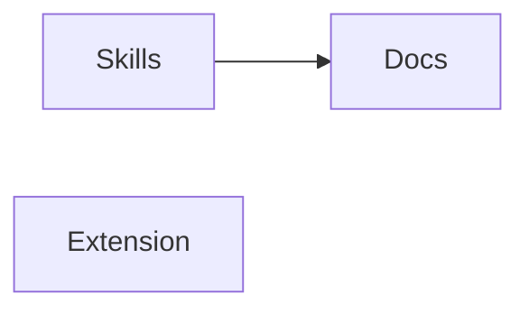
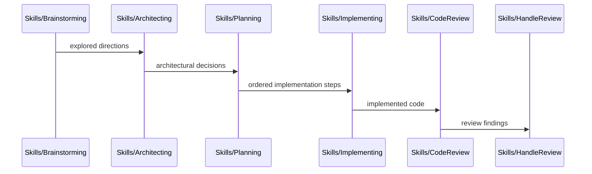

# Codemap

## Overview

A personal [pi coding agent](https://github.com/badlogic/pi-mono) package providing custom workflow skills (brainstorming → architecting → planning → implementing → review) and a provider extension for Azure AI Foundry. Built as a pi package with TypeScript (extension) and Markdown (skills, docs).

### Key Flows

The skills form a sequential development workflow pipeline:

## Modules

### Skills

Agent workflow skills that guide the brainstorm → architect → plan → implement → review pipeline, plus standalone utilities (codemap, debugging).

**Responsibilities:** development workflow orchestration, brainstorming facilitation, architectural decision-making, implementation planning, step-by-step code execution, code review against plans, review finding resolution, codemap generation, structured debugging

**Dependencies:** none (skills are loaded by the pi agent harness at runtime)

**Files:**
- `skills/*/SKILL.md`

### Extension

Azure AI Foundry provider extension that auto-discovers model deployments and registers them as pi models with dynamic Azure AD token refresh.

**Responsibilities:** Azure deployment discovery via az CLI, Azure AD token caching, multi-backend stream routing (Anthropic, OpenAI completions, OpenAI responses), model metadata catalog

**Dependencies:** none (standalone extension loaded by pi)

**Files:**
- `extensions/azure-foundry/**`

### Docs

Design brainstorm documents that record the reasoning and exploration behind each skill's design.

**Responsibilities:** skill design rationale, brainstorm records

**Dependencies:** Skills (documents the design decisions behind each skill)

**Files:**
- `docs/brainstorms/**`
